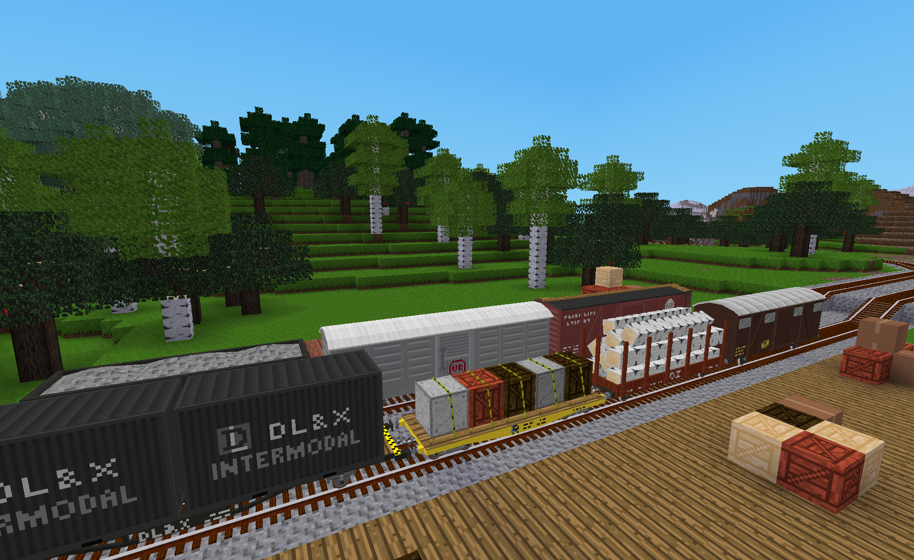

# DlxTrains ModPack

DlxTrains ModPack is an extension for AdvTrains that adds train related content for Minetest train operations.  Features of the modpack include:

- Detailed wagons whose livery and age appearance can be selected by the player.
- Industrial freight wagons, some of which that have visible loads that reflect the wagon's inventory.

## Included mods

Please see the README files for the included mods for important details.

- **DlxTrains** - This is the base mode needed by all other DlxTrains related mods.  It contains common craft items and tools for the modpack plus utilities needed by the other DlxTrains mods.
- **DlxTrains Cargo** - This is an optional mod that adds some cargo nodes as well as additional cargo related textures that can be used by the DlxTrains Industrial Wagons mod.
- **DlxTrains Industrial Wagons** - This mod provides additional freight wagons for use with AdvTrains.  These wagons feature selectable liveries and, in some cases, visible cargo.

## Author's Notes

1) All of the wagons in this modpack will function properly on any of the AdvTrains track.  However, the appearance of some of the longer wagons in this modpack will be more realistic if they are only used on track that is built with large radius curves and shallow slopes.  This is not deemed to be a significant problem since it also happens in the real world that there are some trains that can only run on track that is constructed to accommodate their requirements.

2) All of the wagon liveries in this modpack are intended to be fictional.

3) The wagons in this mod are modeled with some additional detail to highlight a few of their distinct characteristics.  The goal was to achieve a reasonable balance between additional detail while still maintaining an overall appearance appropriate for Minetest.

## Acknowledgements

This modpack would not exist without the prior efforts of the following people:

- **orwell**, creator of [AdvTrains](http://advtrains.de/wiki/doku.php), upon which this modpack depends.
- **rubberduck**, creator of the [moretrains](https://forum.minetest.net/viewtopic.php?f=9&t=24112) modpack for AdvTrains and whose excellent models were an inspiration for starting this project.
- **gpcf**, whose technical work to enable players to paint wagons ([JR E231 Series](https://advtrains.de/wiki/doku.php?id=usage:trains:advtrains_train_jre231)) and wagons to have visible cargo based on their inventory content (see [forum posts](https://forum.minetest.net/viewtopic.php?f=9&t=24112&start=25)) was an inspiration for the texture and model manipulation features of this modpack.

## Licenses

Copyright © 2021 Marnack

- DlxTrains ModPack code is licensed under the GNU AGPL version 3 license, see [LICENSE.txt](LICENSE.txt) for details.
- Unless otherwise specified, DlxTrains ModPack media (models, textures and sounds) are licensed under [CC BY-SA 3.0 Unported](https://creativecommons.org/licenses/by-sa/3.0/).

### Attributions

The following textures from prior art where included in whole or in part in some of the textures for this ModPack:

- From the game for Minetest named "mintest_game":
	- default_acacia_wood.png (CC BY-SA 3.0 by paramat)
	- default_junglewood.png (CC BY-SA 3.0 by paramat)
	- default_pine_wood.png (CC BY-SA 3.0 by paramat)
	- default_tree.png (CC BY-SA 3.0 by Cisoun)
	- default_tree_top.png (CC BY-SA 3.0 by Cisoun)
	- default_wood.png (CC BY-SA 3.0 by BlockMen)

- From the mod for Minetest named "farming":
	- farming_hemp_rope.png (CC BY-SA 3.0 by TenPlus1)
