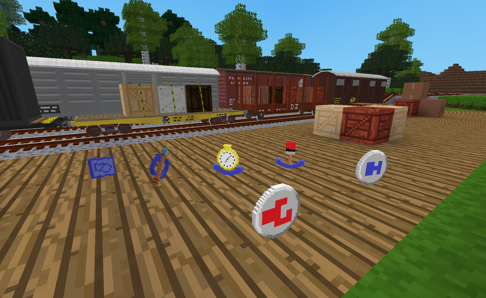

# DlxTrains

DlxTrains is the base mod which is required for all other DlxTrains related mods.  It provides some shared utilities used by other DlxTrains mods as well as some common craft items and tools for players.

Note: DLX is used here to denote items, tools and wagons defined in the DlxTrains ModPack.

## Mod settings

DlxTrains has the following settings.  These settings will also apply to other DlxTrains mods that define additional wagons.

- **Complexity of DLX wagon crafting recipes** (Standard, Basic) - The Standard setting requires that DLX wagons are crafted from intermediate craft items that represent various wagon parts such as couplers, bogies, wheel sets, etc.  The Basic setting simplifies the recipes and reduces the number of craft items added to the game.  It also thereby reduces the overall cost to craft the wagons.  The default is "Standard".

- **Use a random livery when placing wagons** (Enabled/Disabled) - If enabled, a random livery will be selected for the wagon when it is placed.  Otherwise, each wagon will always be placed using a default livery defined for that type of wagon.  A player can change the livery later by using the **DLX Livery Selector Tool**.  The default is "Enabled".

- **Default age appearance for newly placed wagons** (New, Random, Used) - Specifies the initial apparent age of a DLX wagon when it is placed.  A player can change the apparent age later by using the **DLX Age Selector Tool**.  The default is "Random".

## Craft Items

These items are typically needed for crafting DLX wagons and tools.  The "DLX Blueprint" is always defined and added to the game.  The others are only defined when the "**Complexity of DLX wagon crafting recipes**" setting is set to "Standard".

- **DLX Blueprint** - This is a "design document" that is needed to craft many of the items, tools and wagons defined in the DlxTrains ModPack.
- **Bogie** - This is a pair of wheel sets that are connected by a framework that can turn independently of the wagon that it supports.  It is also known as a "truck".
- **Coupler, Buffer & Chain** - This is one of the common early forms of a wagon coupler and is the default coupling system used by AdvTrains.
- **Coupler, Knuckle** - This a common style of wagon coupler that is used in many parts of the world.  This item is a generic representation of the many variations of knuckle coupler.
- **Wagon Chassis** - This is the underframe of the wagon.
- **Wheel Set** - This is a pair of wheels connected by an axle.

## Tools

DLX Tools only work with DLX wagons.  Click near the center (i.e. on the selection box) of the wagon in order for the tool to have an effect.  These tools do not wear out or need to be recharged.

- **DLX Age Selector Tool** - This tool is used to toggle the age appearance of DLX wagons between "nearly new" and "used/weathered".  The amount of "weathering" will differ by livery.  That is to say, the amount of weathering for one livery can be significantly different from that of another livery for the same type of wagon.  This was done intentionally in order to provide more variety to the appearance of trains.  As a side effect, this tool will also update any visible cargo if it is out of sync with the wagon's inventory.
- **DLX Livery Selector Tool** - This tool is used to select the livery of DLX wagons.  A livery in this case is more than just a color scheme.  It also includes markings and logos and occasionally other minor cosmetic variations.  Each DLX wagon will have two or more liveries from which to choose.  Left-clicking (punching) on a DLX wagon with this tool changes it to the next livery.  Holding the sneak key while left-clicking on a DLX wagon changes it to the previous livery.  As a side effect, this tool will also update any visible cargo if it is out of sync with the wagon's inventory.
- **DLX Wagon Updater Tool** - This tool is used to immediately update a DLX wagon's visible cargo in case it is out of sync with its inventory.  Although the visible cargo of a DLX wagon will automatically update the next time the area of the map is reloaded or the game is restarted, this tool can be used to force an immediate update without leaving the area or the game.   Thus, it can be useful to confirm or update a DLX wagon's visible cargo when the inventory of the wagon has just been changed, either manually or automatically via load and unload tracks.

## Licenses

Copyright © 2021 Marnack

- DlxTrains code is licensed under the GNU AGPL version 3 license.
- Unless otherwise specified, DlxTrains media (models, textures and sounds) are licensed under [CC BY-SA 3.0 Unported](https://creativecommons.org/licenses/by-sa/3.0/).
