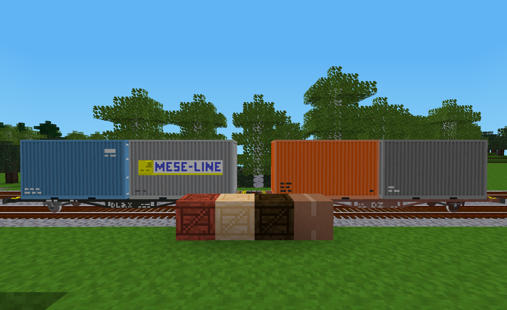

# DlxTrains Cargo

This mod defines additional nodes and cargo for DlxTrains.

Note: DLX is used here to denote items, tools and wagons defined in the DlxTrains ModPack.

## Craft Items

This mod defines one new craft item called "Corrugated Fiberboard" which is used to craft a "Corrugated Box".

## Nodes

The following nodes defined in this mod do not currently function as containers.  While that might change in a future release of this mod, they are primarily intended as decoration and perhaps even construction material.  They should be useful for detailing warehouses, train stations and freight yards.

- **Corrugated Box** - Often referred to as a cardboard box, these are typically used indoors or areas that are protected from the weather.  They are currently not visible as cargo on DLX wagons.
- **Wooden Crate** (Acacia Wood, Jungle Wood and Pine Wood versions).  These wooden containers are durable and resistant to typical weather conditions.  They are therefore found in both indoor and outdoor locations.  When this mod is enabled, these crates may not only be placed as normal nodes and as cargo on train wagons, but they will also be randomly used as visible cargo on some DLX wagons to represent items and nodes that are typically shipped in a container.

## Additional Shipping Containers

This mod defines 18 additional textures for large modern shipping containers.  These containers would be much larger than the standard cubic meter node in Minetest and thus are not currently implemented to be placed directly in the world.  However, they can appear on the container wagons that are defined in the DlxTrains Industrial Wagons mod.  Enabling this mod allows these additional textures to be used by that mod.  As with the liveries defined for DLX wagons, the shipping container liveries in this mod are all intended to be fictional.

## Additional Tank Containers

This mod defines 14 additional textures for modern tank containers (also known as an "ISO Tank" or a "Tanktainer").  As with shipping containers these containers are not currently implemented to be placed directly in the world.  However, they can appear on the container wagons that are defined in the DlxTrains Industrial Wagons mod.  Enabling this mod allows these additional textures to be used by that mod.  These tank container liveries are also intended to be fictional.

## Licenses

Copyright © 2021-2024 Marnack

- DlxTrains Cargo code is licensed under the GNU AGPL version 3 license.
- Unless otherwise specified, DlxTrains Cargo media (models, textures and sounds) are licensed under [CC BY-SA 3.0 Unported](https://creativecommons.org/licenses/by-sa/3.0/).

### Attributions

The following textures from prior art where included in whole or in part in some of the textures for this mod:

- From the game for Minetest named "mintest_game":
	- default_acacia_wood.png (CC BY-SA 3.0 by paramat)
	- default_junglewood.png (CC BY-SA 3.0 by paramat)
	- default_pine_wood.png (CC BY-SA 3.0 by paramat)

