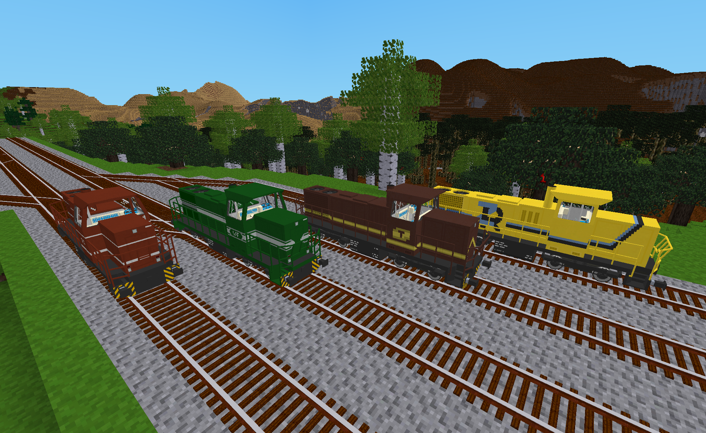
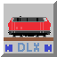
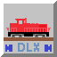
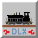

# DlxTrains Diesel Locomotives

This mod adds AdvTrains compatible diesel locomotives in multiple liveries to Minetest.

Note: DLX is used here to denote items, tools, wagons and locomotives defined in the DlxTrains ModPack.

## Craft Items

The following craft items are defined and added to the game if the "Complexity of DLX wagon crafting recipes" setting defined in **DlxTrains** is set to "Standard".  They are not added to the game if it is set to "Basic".  The default value for the setting is "Standard".

- **Diesel Locomotive Battery Pack** - This item represents the batteries that provide power to the locomotive's electrical systems.  They are recharged when the diesel engine is running.  Note that battery power for DLX diesel locomotives is not currently represented or tracked in game.
- **Diesel Locomotive Bogie** - Similar to the bogies used on wagons, this is a pair of wheel sets that are connected by a framework that can turn independently of the locomotive that it supports.  Unlike wagon bogies, however, it also contains gearboxes or electric motors (depending on the type of diesel locomotive) that are used to propel the train.
- **Diesel Locomotive Chassis** - This is the underframe of the locomotive.
- **Diesel Locomotive Cooling Fan** - This is an electric motor and a set of metal fan blades that are used to force air through a set of radiators to cool the engine while it is running.
- **Diesel Locomotive Cooling Unit** - Constructed from a cooling fan and  radiators, this component is used to keep the locomotive's engine temperature in a safe, operational range.  Small  shunting locomotives may only have one of these while larger main line diesel locomotives may have many.
- **Diesel Locomotive Engine** - This is an internal combustion engine and is the primer power source for diesel locomotives.  There are several different types of diesel locomotives which are typically classified based on how they use their diesel engine.  Some locomotives use their engine's power directly to move the locomotive such as with diesel-hydraulic and diesel-mechanical locomotives.  Others, such as the diesel-electric locomotive, use the engine to power a generator that provides electricity to electric motors that are built into their bogies.
- **Diesel Locomotive Fuel Tank** - This item represents the locomotive's fuel tank.  Note that fuel is not currently represented or tracked in game which means that DLX locomotives can run indefinitely.
- **Diesel Locomotive Generator** - The generator is connected to the output shaft of the engine to generate electricity.  In a diesel-electric locomotive, this electricity is used to power the motors that are built into their bogies.
- **Diesel Locomotive Hood** - Typically made from sheet metal and various structural elements, hoods are the outer covering of the locomotive's engine, its transmission and other vital components.  Depending on the design of the locomotive it will typically have one or two of these.
- **Diesel Locomotive Hydraulic Transmission** - This component is used to transfer power from the engine to the drive shaft and bogies and to control speed and direction.
- **Diesel Locomotive Radiator** - Radiators are a critical element of a diesel engine since they are needed to keep it from over-heating and becoming permanently damaged. They typically consist of long coiled tubes to which many metal fins are attached.  Fluid is circulated through the engine, into the radiators and back.  The fluid thus transfers the heat from the engine to the metal fins where the heat is radiated into the air and away from the engine.
- **European BR218 Diesel Locomotive Body** - This is the set of components that are added to a chassis to make a European BR218 Diesel Locomotive.
- **European G1206 Diesel Locomotive Body** - This is the set of components that are added to a chassis to make a European G1206 Diesel Locomotive.
- **North American SW1500 Diesel Locomotive Body** - This is the set of components that are added to a chassis to make a North American SW1500 Diesel Locomotive.

## Locomotives

The following table summarizes the current set of DlxTrains Diesel Locomotives.

Icon|Wagon Name|Length (m)|Coupler Type|Max Speed (m/s)|Livery Options
:---:|---|:---:|---|:---:|:---:
|European BR218 Diesel Locomotive|8.2|Buffer & Chain|25|2
|European G1206 Diesel Locomotive|7.35|Buffer & Chain|25|4
|North American SW1500 Diesel Locomotive|6.81|Knuckle|25|2

Note that locomotives may not be available in-game if the "Longest DLX wagon to include in game" setting defined in **DlxTrains** is set to a value other than "Unlimited".  That setting will use the lengths shown in the table when determining the locomotives to be excluded.

### European BR218 Diesel Locomotive

The European BR218 Diesel Locomotive in DlxTrains is loosely based on the DB Class 218 diesel-hydraulic locomotive that was built for the Deutsche Bundesbahn in Germany beginning in 1968.  Nearly 400 units were built and played a key role in both passenger and freight service for more than 20 years, with many units remaining in service even longer.

In game, the locomotive features several effects when the locomotive is moving:
* The main lights will appear to turn on (but not illuminate) based on the locomotive's direction of movement.
* Its radiator cooling fan will appear to be spinning while the locomotive is moving.
* The diesel engine's sound will change based on the locomotive's velocity (unless this feature is disabled in the **DlxTrains** mod settings).
* The amount of diesel smoke produced by the locomotive will vary based on its acceleration, velocity and the length of the train (unless this feature is disabled in the **DlxTrains** mod settings).

The locomotive has two driver's cabs, one at each end. Players can choose to be located in either cab 1 or cab 2, switching between the two even while the locomotive is moving. This can be especially useful when changing the direction of travel.  For the best in-cab experience, use the optional [advtrains_attachment_offset_patch](https://content.minetest.net/packages/doxygen_spammer/advtrains_attachment_offset_patch/)

### European G1206 Diesel Locomotive

The European G1206 Diesel Locomotive in DlxTrains is loosely based on the MaK/Vossloh G1206 diesel-hydraulic locomotive that was built in Kiel, Germany beginning in 1997.  It was designed for both heavy shunting and main line freight duties and was used by both state and private railway operators.

In game, the locomotive features several effects when the locomotive is moving:
* The head and tail lights will appear to turn on (but not illuminate) based on the locomotive's direction of movement.
* Its two radiator cooling fans will appear to be spinning while the locomotive is moving.
* The diesel engine's sound will change based on the locomotive's velocity (unless this feature is disabled in the **DlxTrains** mod settings).
* The amount of diesel smoke produced by the locomotive will vary based on its acceleration, velocity and the length of the train (unless this feature is disabled in the **DlxTrains** mod settings).

The MaK/Vossloh G1206 locomotive is driven with either end being used as "forward".  Since there seems to be some preference by real world engineers to drive with the "short hood" end as forward due to better visibility, player avatars are positioned to face in that direction when in the cabin of the European G1206 Diesel Locomotive.

### North American SW1500 Diesel Locomotive

The North American SW1500 Diesel Locomotive in DlxTrains is loosely based on the EMD SW1500 diesel-electric locomotive built by General Motors in the middle of the twentieth century.  More than 800 units of this shunting locomotive were built, with many of them also being used for mainline freight service.

In game, the locomotive features the following effects when the locomotive is moving:
* The headlights will appear to turn on (but not illuminate).
* The diesel engine's sound will change based on the locomotive's velocity (unless this feature is disabled in the **DlxTrains** mod settings).
* Smoke will emanate from both of the locomotive's exhaust stacks. The amount of diesel smoke produced by the locomotive will vary based on its acceleration, velocity and the length of the train (unless this feature is disabled in the **DlxTrains** mod settings).

## Visible Unit Numbers

Players can optionally customize their locomotives with a visible unit number that is unique to each locomotive.  The locomotive's unit number will be displayed on the exterior of the locomotive if a number is specified in the "Wagon road number" field of the "Wagon properties" formspec.  (Access the formspec via right mouse button click after boarding the locomotive.)  Although any value may be specified in this field, only a positive whole number with a value from 0 to 999 will trigger the number to be displayed on the exterior of the locomotive.  If included, leading zeros and spaces will be shown as leading zeros.  Thus, a value of "04" or " 4" would both be shown as "04".  Also note that each livery defines the location, color and size of the unit number. Examples of where the unit number may be displayed include the side of the cabin, the sides of the hood or on the side of the fuel tank.  (Tip: Use the **DLX Wagon Updater Tool** on the locomotive to quickly confirm the change after setting or editing the unit number.)

> Note for players running Minetest on Windows: There is currently an issue with formspecs in that the button to show the wagon properties formspec may need to be clicked *many* times before it will eventually display.  This is a low level problem that happens with non DLX locomotives and wagons as well.  Linux versions of Minetest do not seem to have this issue.

## Notes

Due to current limitations in Minetest, the player's view while on board the locomotive will be from a point in space just above the center of the locomotive rather than from inside the cabin.  While this viewpoint is certainly sufficient, switching to third person view while driving the locomotive provides a slightly different perspective from outside the locomotive that might also be useful.  Alternatively, DlxTrains now supports the [advtrains_attachment_offset_patch](https://content.minetest.net/packages/doxygen_spammer/advtrains_attachment_offset_patch/) as an optional dependency which provides a fix for the issue.

## Licenses

Copyright © 2022-2023 Marnack

- DlxTrains Diesel Locomotives code is licensed under the GNU AGPL version 3 license.
- Unless otherwise specified, DlxTrains Diesel Locomotives media (models, textures and sounds) are licensed under [CC BY-SA 3.0 Unported](https://creativecommons.org/licenses/by-sa/3.0/).
