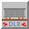
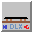
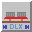
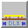
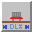
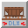
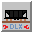

# DlxTrains Industrial Wagons

This mod adds AdvTrains compatible industrial wagons to Minetest.  These wagons are loosely modeled on real world wagons from different geographies and eras.

Note: DLX is used here to denote items, tools and wagons defined in the DlxTrains ModPack.

## Craft Items

The following craft items are defined and added to the game if the "Complexity of DLX wagon crafting recipes" setting defined in DlxTrains is set to "Standard".  They are not added to the game if it is set to "Basic".  The default value for the setting is "Standard".

- **Australian Louver Van Cargo Housing** - This item is used to craft metal louver vans of the type built in Australia.
- **Container Wagon Cargo Mounts** - This item is used to craft shipping container wagons.
- **Container Wagon Single Cargo Mount** - This item is used to craft smaller shipping container wagons
- **European Wooden Covered Goods Wagon Cargo Housing** - This item is used to craft wooden box wagons of the type built in Europe.
- **Flat Wagon Cargo Deck** - This item is used to craft flat wagons.
- **Hopper Wagon Cargo Bin** - This item is used to craft hopper wagons.
- **North American Wooden Boxcar Cargo Housing** - This item is used to craft wooden boxcars of the type built in North America.
- **Stake Wagon Cargo Deck** - This item is used to craft stake wagons.

## Wagons

The following table summarizes the full set of DlxTrains Industrial Wagons.

Icon|Wagon Name|Length (m)|Coupler Type|Inventory Size|Max Speed (m/s)|Livery Options
:---:|---|:---:|---|:---:|:---:|:---:
|Australian Louver Van|8|Knuckle|40|25|3
|Buffer/Knuckle Transition Wagon|6|Buffer & Chain / Knuckle|24|20|2
|European Container Wagon|8.5|Buffer & Chain|32|20|2
|European Flat Wagon|6|Buffer & Chain|24|20|2
|European Single Container Wagon|4.9|Buffer & Chain|16|20|2
|European Stake Wagon|6|Buffer & Chain|24|20|3
|European Wooden Covered Goods Wagon|7|Buffer & Chain|32|20|2
|North American Covered Hopper Wagon|6|Knuckle|24|25|2
|North American Hopper Wagon|6|Knuckle|24|25|2
|North American Wooden Boxcar|8|Knuckle|40|25|3

Note that some wagons may not be available in-game if the "Longest DLX wagon to include in game" setting defined in **DlxTrains** is set to a value other than "Unlimited".  That setting will use the lengths shown in the table when determining the wagons to be excluded.

### Australian Louver Van

This is an Australian wagon loosely modeled on a louver van which first saw service in southern Australia in the late 1920's.  Although initially built with buffer and chain couplers, the wagons were later retrofitted with knuckle couplers.  Since they seem to have been equipped with knuckle couplers for a majority of their service life, they are the couplers used in this mod's version of the wagon. 

### Buffer/Knuckle Transition Wagon

Transition wagons, also known as barrier wagons or match wagons, are used to connect wagons that have different couplers.  Flat wagons are typically used for this purpose in the real world since they are usually the lightest wagon available.  Note that AdvTrains does not notice the type of coupler modeled on each wagon so this wagon is not strictly needed in game.  However, it is provided here for those players who are interested in having visually accurate coupled wagons.  DLX Transition wagons are otherwise functionally identical to the flat wagon.

### European Container Wagon

Modeled after a mid to late 20th century European container wagon, this wagon can appear in one of three load states.  When its inventory is empty it will have no visible shipping containers and players will be able to view the entire framework of this relatively lightweight wagon.  When a small amount of inventory is present, one shipping container will be visible, centered in the middle of the wagon.  When the wagon has significant inventory, a second shipping container will be visible.  The livery of the shipping containers will match the livery of the wagon.  However, if the **DlxTrains Cargo** mod is enabled, additional shipping container liveries will become available.  The livery of each shipping container will then be pseudo-randomly selected from the set of available liveries.

### European Flat Wagon

Although not the first wagon to use bogies in Europe, this early 20th century freight wagon allowed significant versatility for large and oddly shaped loads.

In game, these wagons have four load states: no load, light load, medium load and large load.  When the wagon is lightly loaded, a single node will appear on the wagon as its cargo.  If the cargo is applicable for a flat wagon and can be simply rendered, it will be shown as itself.  Otherwise it will be shown as a crate.  For a moderately full inventory, three nodes will be rendered as the cargo.  As with the previous case, one of the additional nodes with be rendered as itself or a crate.  The third node will always be shown as a crate.  In the case of a large load, five nodes with be shown on the wagon, all of them either as one or more of the inventory items or as a crate.   If the DlxTrains Cargo mod is enabled, additional wooden crates will become available.  These additional crates will then be pseudo-randomly selected from the set of available crates.

### European Single Container Wagon

This fictional wagon is a shortened version of the European Container Wagon that may be better suited for some railways in Minetest.  It has two load states, empty and with a single shipping container whenever inventory is present.  Like the larger container wagon, the livery of the shipping container will match the livery of the wagon.  However, if the **DlxTrains Cargo** mod is enabled, additional shipping container liveries will become available.  The livery of the shipping container will then be pseudo-randomly selected from the set of available liveries.

### European Stake Wagon

The design of this wagon is based on similar wagons used in Europe in the mid 20th century.  Although commonly used in the logging industry, this wagon could be used in other situations as well.  Thus, when this DLX wagon is not carrying logs, it will display cargo similar to a flat wagon.

### European Wooden Covered Goods Wagon

This wooden freight wagon was modeled on one of the main covered goods wagons used in Europe in the early to mid 20th century.  Perhaps its most recognizable feature are the four vent covers on each side of the wagon.  These vents enabled the wagons to carry a greater diversity of cargo types and, in some situations, were even used for loading the wagon.

### North American Covered Hopper Wagon

This is the covered version of the early 20th century North American hopper wagon listed below.  This type of wagon was used when loose bulk commodities being transported needed to be protected from the weather, such as when transporting grain, sugar or fertilizer.  The wagon includes a roof with 8 loading hatches and a steel mesh "roof walk" that was common for the era.

### North American Hopper Wagon

This wagon is modeled on an early 20th century two bay hopper wagon that was used in North America.  Although larger three bay hopper wagons eventually replaced these, this all-steel design played a key role in the industrial era of North America.

In game, these wagons will display a visible load whenever the inventory is not empty.  If the load is applicable to a hopper wagon, such as dirt, sand, gravel or coal, the corresponding load will be visible.  Otherwise, a generic "mixed materials" texture will be shown to indicate that the inventory is not empty but the cargo is likely not appropriate for a hopper wagon.

### North American Wooden Boxcar

This wagon is modeled after the early to mid 20th century boxcars used in North America.  Most boxcars of this era were painted "boxcar red" which was not a single distinct color but any hue from a range of colors spanning red-brown to orange-brown.  Another feature of boxcars from this era was the presence of a "roof walk".  This was a wooden walkway that was constructed on the roof of the boxcars to allow the brakemen to quickly move from wagon to wagon to turn each wagon's brake wheel when needed.  This was of course a dangerous occupation and so "roof walks" were banned in the 1960's, with the last remaining ones finally eliminated in the 1980's.

## Wagon Inventory Management

*Note: The following information is optional and may be skipped by players who are content with the visible cargo being managed automatically.*

For those DLX wagons that can display visible cargo or cargo containers, DlxTrains will use a pseudo-random algorithm to display the cargo or containers.  However, for players that are interested in specifying exactly which cargo or container is visible on a wagon, that can be accomplished by managing the arrangement and quantities of items and nodes in the wagon's inventory.

When viewing the inventory formspec of DLX wagons that have the ability to display their cargo, one or more of the wagon's inventory slots will be highlighted with a blue-green color.  Adjusting the type or quantities of items in those particular slots will cause a change in the displayed cargo or containers.  (Tip: Use the **DLX Wagon Updater Tool** to quickly confirm the change after adjusting the inventory.) Although each type of DLX wagon that supports visible loads may behave slightly differently, adding or removing one item from these special slots will allow a player to select the next or previous container (crate or shipping container).  In the case of loads where the item is visible as itself, any non-zero quantity is equivalent.  The European Stake Wagon will only show logs as its cargo when one or more tree nodes are placed in the first (upper-left) inventory slot, otherwise it will display its cargo similar to a flat wagon.

## Licenses

Copyright © 2021 Marnack

- DlxTrains Industrial Wagons code is licensed under the GNU AGPL version 3 license.
- Unless otherwise specified, DlxTrains Industrial Wagons media (models, textures and sounds) are licensed under [CC BY-SA 3.0 Unported](https://creativecommons.org/licenses/by-sa/3.0/).

### Attributions

The following textures from prior art where included in whole or in part in some of the textures for this mod:

- From the game for Minetest named "mintest_game"
	- default_pine_wood.png (CC BY-SA 3.0 by paramat)
	- default_tree.png (CC BY-SA 3.0 by Cisoun)
	- default_tree_top.png (CC BY-SA 3.0 by Cisoun)
	- default_wood.png (CC BY-SA 3.0 by BlockMen)

- From the mod for Minetest named "farming":
	- farming_hemp_rope.png (CC BY-SA 3.0 by TenPlus1)
