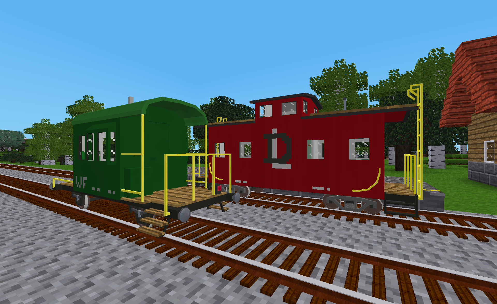

# DlxTrains Support Wagons

This mod adds AdvTrains compatible support wagons to Luanti games.  In reality, these wagons are used to support railway operations and do not typically generate revenue as passenger and freight wagons do.  These wagons are loosely modeled on real world wagons from different geographies and eras.

Note: DLX is used here to denote items, tools and wagons defined in the DlxTrains ModPack.

## Craft Items

The following craft items are defined and added to the game if the "Complexity of DLX wagon crafting recipes" setting defined in DlxTrains is set to "Standard".  They are not added to the game if it is set to "Basic".  The default value for the setting is "Standard".

- **Small Escort Wagon Cabin** - This item is used to craft small escort wagons.
- **Wooden Caboose Cabin with Cupola** - This item is used to craft wooden cabooses.

## Wagons

The following table summarizes the full set of DlxTrains Support Wagons.

Icon|Wagon Name|Length (m)|Coupler Type|Seats|Max Speed (m/s)|Livery Options
:---:|---|:---:|---|:---:|:---:|:---:
|European Escort Wagon|4.9|Buffer & Chain|3|20|4
|Wooden Caboose with Cupola|6.0|Knuckle|4|25|4

Note that some wagons may not be available in-game if the "Longest DLX wagon to include in game" setting defined in **DlxTrains** is set to a value other than "Unlimited".  That setting will use the lengths shown in the table when determining the wagons to be excluded.

### European Escort Wagon

This wagon is modeled after the small escort wagon (unofficially referred to as, "Sputnik") that was typically attached to the end of freight trains operating in the Swiss Alps during the second half of the 20th century.  It was primarily used to carry a few crew members who would assist with with freight operations.  In game, this wagon has two seating areas: in the cabin and on the veranda (sitting on the propane tank cabinet).

### Wooden Caboose with Cupola

This model is a generalized representation of a typical caboose used in North America in the first half of the 20th century.  It consists of a wooden cabin built on a steel frame and features a cupola that allows crew members to more easily monitor the train. This caboose has two seating areas: in the main cabin and in the cupola.

## Licenses

Copyright © 2021-2025 Marnack

- DlxTrains Support Wagons code is licensed under the GNU AGPL version 3 license.
- Unless otherwise specified, DlxTrains Support Wagons media (models, textures and sounds) are licensed under [CC BY-SA 3.0 Unported](https://creativecommons.org/licenses/by-sa/3.0/).

### Attributions

The following textures from prior art where included in whole or in part in some of the textures for this mod:

- From the game for Luanti named "mintest_game"
		- default_wood.png (CC BY-SA 3.0 by BlockMen)
